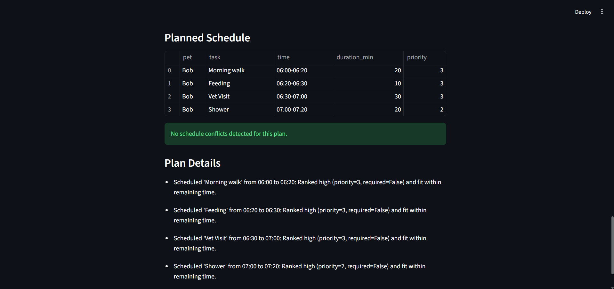

# PawPal+ (Module 2 Project)

You are building **PawPal+**, a Streamlit app that helps a pet owner plan care tasks for their pet.

## Scenario

A busy pet owner needs help staying consistent with pet care. They want an assistant that can:

- Track pet care tasks (walks, feeding, meds, enrichment, grooming, etc.)
- Consider constraints (time available, priority, owner preferences)
- Produce a daily plan and explain why it chose that plan

Your job is to design the system first (UML), then implement the logic in Python, then connect it to the Streamlit UI.

## What you will build

Your final app should:

- Let a user enter basic owner + pet info
- Let a user add/edit tasks (duration + priority at minimum)
- Generate a daily schedule/plan based on constraints and priorities
- Display the plan clearly (and ideally explain the reasoning)
- Include tests for the most important scheduling behaviors

## Features

- Multi-pet planning: generates a single owner-level daily plan across all pets, with optional single-pet planning.
- Constraint filtering: filters tasks using owner constraints such as max task duration, preferred time windows, and task enabled state.
- Time-aware sorting: sorts tasks by earliest due time first, then uses a deterministic tie-break with computed task score and task ID.
- Priority scoring: ranks urgency using priority, required status, due-time proximity, owner category preferences/weights, and pet special-needs context.
- Greedy time allocation: schedules tasks in order while time remains, with optional preferred-window placement and skip-on-mismatch behavior.
- Flexible filtering: supports filtering tasks by completion status and pet name before planning.
- Recurrence rollover: completing daily/weekly tasks automatically creates the next occurrence with a new due date.
- Conflict warnings: detects overlapping planned items (same-pet and cross-pet) and reports warnings instead of crashing.
- Explainable plans: generates per-task explanations for why tasks were scheduled or skipped.

## Smarter Scheduling

Recent scheduling upgrades make plans more practical and explainable:

- Time-aware sorting: tasks can be ordered by due time so earlier deadlines are handled first.
- Flexible filtering: tasks can be filtered by completion status and by pet name.
- Recurrence rollover: completing a daily or weekly task automatically creates the next occurrence.
- Conflict warnings: overlapping planned tasks are detected and reported as warnings instead of crashing.
- Better demos/tests: sample data now includes out-of-order tasks and overlap checks to verify behavior.

## Testing PawPal+

Run the automated test suite with:

```bash
python -m pytest
```

The tests focus on the most important scheduling behaviors:

- Sorting correctness, including due-time ordering and deterministic tie-breaks.
- Recurrence logic, including daily/weekly rollover and non-recurring/idempotent completion behavior.
- Conflict detection, including overlap warnings for same-pet and cross-pet plans, plus boundary non-overlap cases.

Current reliability confidence: **High**. All tests are passing, which gives strong confidence that core scheduling behavior is stable for expected and edge-case scenarios covered by the suite.

## Getting started

### Setup

```bash
python -m venv .venv
source .venv/bin/activate  # Windows: .venv\Scripts\activate
pip install -r requirements.txt
```

### Suggested workflow

1. Read the scenario carefully and identify requirements and edge cases.
2. Draft a UML diagram (classes, attributes, methods, relationships).
3. Convert UML into Python class stubs (no logic yet).
4. Implement scheduling logic in small increments.
5. Add tests to verify key behaviors.
6. Connect your logic to the Streamlit UI in `app.py`.
7. Refine UML so it matches what you actually built.

